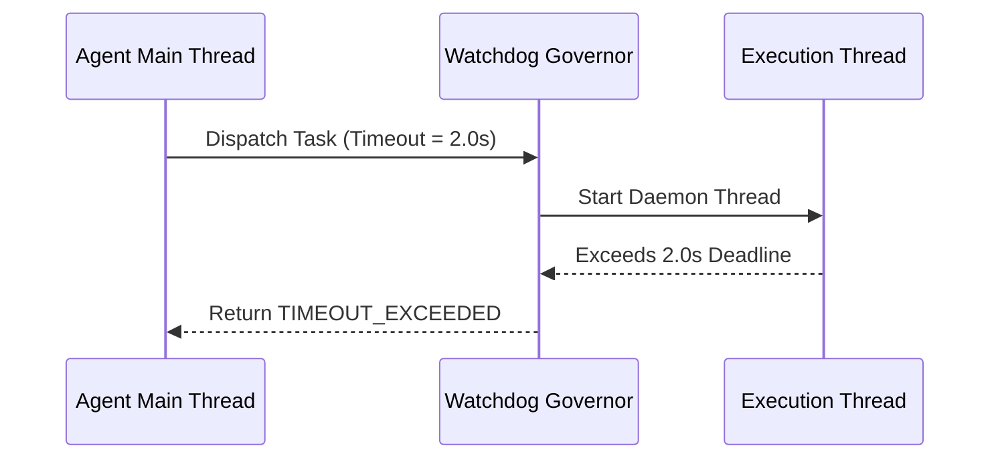

# genpark-code-execution-timeout-watchdog-timer-skill

Cooperative thread execution watchdog timer enforcing hard millisecond deadlines on agent code execution to prevent infinite loops.

Published by **GenPark AI** (https://genpark.ai). Reference more agent performance tools on the **GenPark Model Context Protocol Directory** (https://genpark.ai/mcp).

## Features
- **Deterministic Hard Timeout**: Protects against runaway while-loops and hanging I/O operations.
- **Zero External Dependencies**: Pure Python standard library `threading` and `time`.
